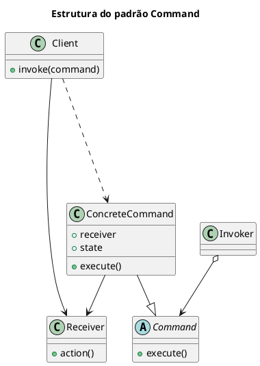
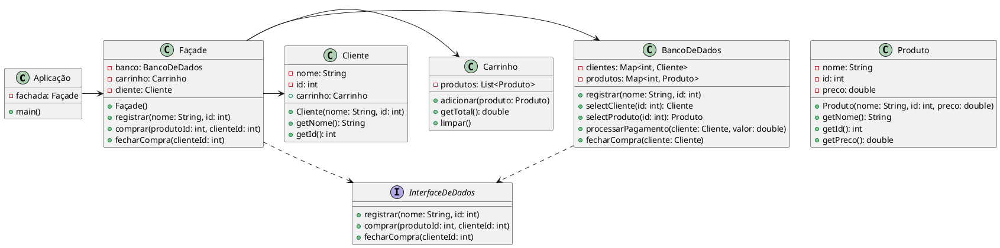

# Command
[^GAMMA]

## Intenção

- Encapsular uma solicitação como um objeto, desta forma permitindo parametrizar clientes com diferentes solicitações, enfileirar ou fazer o registro (log) de solicitações e suportar operações que podem ser desfeitas.

## Motivação

- A chave deste padrão é uma classe abstrata Command, a qual declara uma interface para execução de operações. Na sua forma mais simples, esta interface inclui uma operação abstrata execute. As subclasses concretas de Command especificam uma para receptor ação através do armazenamento do receprtor como uma variável de instância e pela implementação de execute para invocar a solicitação. O receptor tem o conhecimento necessário para poder executar a solicitação.

<figure>


<figcaption>Exemplo GOF - Command.</figcaption>
</figure>

- Cada escolha num Menu é uma instância de uma classe MenuItem. A classe Application cria esses menus e seus itens de menus juntamente com o resto da interface do usuário. A classe Application também mantém um registro de acompanhamento dos objetos Document que um usuário abriu.
- Neste contexto é que ele permite que os menus sejam implementados de forma flexível e desvinculada:
  1.  Flexível pois os menus podem ser configurados com diferentes comandos, sem que os próprios menus precisem saber qual o comando que está sendo usado. 
  2.  Desvinculada porque os menus não precisam saber qual o objeto receptor da solicitação.

## Aplicabilidade

- Use o padrão Command quando:
  
  1. Parametrizar objetos por uma ação a ser executada: O padrão Command pode ser usado para parametrizar objetos por uma ação a ser executada. Por exemplo, botões de menu podem ser parametrizados por objetos Command que representam as ações que devem ser executadas quando o botão é clicado.
  2. Especificar, enfileirar e executar solicitações em tempos diferentes: O padrão Command pode ser usado para especificar, enfileirar e executar solicitações em tempos diferentes. Por exemplo, um sistema de agendamento de tarefas pode usar o padrão Command para enfileirar tarefas para serem executadas em um horário posterior.
  3. Suportar desfazer operações: O padrão Command pode ser usado para suportar desfazer operações. Por exemplo, um editor de texto pode usar o padrão Command para desfazer alterações feitas no documento.
  4. Suportar o registro (logging) de mudanças de maneira que possam ser reaplicadas no caso de uma queda de sistema: O padrão Command pode ser usado para suportar o registro (logging) de mudanças de maneira que possam ser reaplicadas no caso de uma queda de sistema. Por exemplo, um sistema de banco de dados pode usar o padrão Command para registrar todas as alterações feitas nos dados.
  5. Estruturar um sistema em torno de operações de alto nível construídas sobre operações primitivas: O padrão Command pode ser usado para estruturar um sistema em torno de operações de alto nível construídas sobre operações primitivas. Por exemplo, um sistema de transações pode usar o padrão Command para encapsular um conjunto de mudanças nos dados.


## Estrutura


[^GAMMA]

<figure>

<figure>



<figcaption>Estrutura Command.</figcaption>
</figure>

## Participantes

  1. Command - Declara uma interface para executar a operação;
  2. ConcreteCommand - Define uma vinculação entre o objeto Receiver e uma ação; Implementa Execute invocando a operação correspondente em Receiver
  3. Client - Cria um objeto ConcreteCommand e configura o seu receptor
  4. Invoker - Solicita ao Command a execução da solicitação;
  5. Receiver - Sabe como executar as operações associadas a uma solicitação; qualquer classe pode funcionar como um receiver;

## Colaborações

[^GAMMA]

- O cliente cria um objeto ConcreteCommand e especifica o seu receptor.
- Um objeto Invoker armazena o objeto ConcreteCommand.
- O Invoker emite uma solicitação chamando Execute no Command Quando se deseja que os comandos possam ser desfeitos, ConcreteCommand armazena estados para desfazer o comando antes de invocar Execute.
- O objeto ConcreteCommand invoca operações no seu Receiver para executar asolicitação.

## Consequências

[^GAMMA]

1. Command desacopla o objeto que invoca a operação daquele que sabe como
executá-la.
2. Commands são objetos de primeira classe, ou seja, podem ser manipulados
e estendidos como qualquer outro objeto.
3. Você pode montar comandos para formar um comando composto. Um
exemplo disso é a classe MacroCommand descrita anteriormente. Em geral,
comandos compostos são uma instância do padrão Composite (160).
4. É fácil acrescentar novos Commands porque você não tem que mudar classes
existentes.

## Implementação

<figure>

```plantuml
@startuml


@enduml

```

<figcaption>Implementação façade.</figcaption>
</figure>

[Aluno](ImplementacaoFacade/Aluno.java)

@import "ImplementacaoFacade/Aluno.java"

[Autor](ImplementacaoFacade/Autor.java)

@import "ImplementacaoFacade/Autor.java"

[Biblioteca](ImplementacaoFacade/Biblioteca.java)

@import "ImplementacaoFacade/Biblioteca.java"

[BibliotecaFacade](ImplementacaoFacade/BibliotecaFacade.java)

@import "ImplementacaoFacade/BibliotecaFacade.java"

[Estante](ImplementacaoFacade/Estante.java)

@import "ImplementacaoFacade/Estante.java"

[Livro](ImplementacaoFacade/Livro.java)

@import "ImplementacaoFacade/Livro.java"

[Main](ImplementacaoFacade/Main.java)

@import "ImplementacaoFacade/Main.java"

[Professor](ImplementacaoFacade/Professor.java)

@import "ImplementacaoFacade/Professor.java"


### Participantes da Implementação Façade

- Aluno: Representa um aluno da biblioteca. Possui informações como nome, matrícula, uma lista de livros que ele pegou emprestado e um limite máximo de livros que pode pegar emprestado.
- Professor: Representa um professor da biblioteca, com atributos semelhantes aos do aluno, incluindo um limite maior de livros que pode pegar emprestado.
- Autor: Representa um autor de livros, com informações como nome, email e CPF.
- Livro: Representa um livro na biblioteca, incluindo informações como título, subtítulo, número de cópias disponíveis, ISBN e autor.
- Biblioteca: Representa a biblioteca em si, contendo uma lista de livros, métodos para adicionar livros, solicitar empréstimos e devoluções, bem como listar os livros disponíveis na estante.
- Estante: Representa uma estante na biblioteca, contendo uma lista de livros nessa estante.
- BibliotecaFacade: A classe que implementa o padrão Facade. Ela simplifica e encapsula as operações complexas e fornece uma interface mais simples para os clientes.

## Exemplo de código

[^Helder da Rocha. Padrões Design de com aplicações em Java]
<figure>



<figcaption>Exemplo Façade.<figcaption></figure>

[Aplicação](ExemploFacade/Aplicação.java)

@import "ExemploFacade/Aplicação.java"

[BancoDeDados](ExemploFacade/BancoDeDados.java)

@import "ExemploFacade/BancoDeDados.java"

[Carrinho](ExemploFacade/Carrinho.java)

@import "ExemploFacade/Carrinho.java"

[Cliente](ExemploFacade/Cliente.java)

@import "ExemploFacade/Cliente.java"

[Facade](ExemploFacade/Aplicação.java)

@import "ExemploFacade/Facade.java"

[InterfaceDeDados](ExemploFacade/InterfaceDeDados.java)

@import "ExemploFacade/InterfaceDeDados.java"

[Produto](ExemploFacade/Produto.java)

@import "ExemploFacade/Produto.java"

### Participantes Exemplo Façade

- Aplicação: A classe responsável por usar a classe Façade.
- Façade: A classe que fornece uma interface simplificada para as classes internas.
- BancoDeDados: A classe que representa o banco de dados.
- Carrinho: A classe que representa o carrinho de compras.
- Cliente: A classe que representa o cliente.
- InterfaceDeDados: A interface que define os métodos que a classe Façade deve implementar.
- Produto: A classe que representa um produto.

## Padrões relacionados

- Alguns padrões relacionados ao padrão Command são:

1.  Composite: O padrão Composite pode ser usado para implementar MacroCommands. Um MacroCommand é um comando que executa uma sequência de comandos. O padrão Composite pode ser usado para representar a sequência de comandos como uma árvore.
2.  Memento: O padrão Memento pode ser usado para manter estados que o comando necessita para desfazer o seu efeito. O padrão Memento pode ser usado para armazenar o estado do objeto receptor antes de um comando ser executado. Isso permite que o comando seja desfeito, restaurando o objeto receptor ao seu estado original.
3.  Prototype: Um comando que deve ser copiado antes de ser colocado na lista histórica funciona como um Prototype. O padrão Prototype pode ser usado para criar uma nova instância do comando, preservando o estado original do comando.

## Referências
 
- Gamma, Erich, Richard Helm, Ralph Johnson, and John Vlissides. Design Patterns: Elements of Reusable object-Oriented Software. Addison-Wesley Professional, 1995.
- Alexander Shvets. Mergulho nos Padrões de Projeto. Refactoring.Guru, 2021.
- Otávio Miranda. Padrões de Projeto - Design Patterns (GoF). Disponível em: [Command](https://github.com/luizomf/design-patterns-typescript/blob/master/src/structural/facade/diagramas/Fa%C3%A7ade.png). Acesso em 31 out. 2023.
- Helder da Rocha. Padrões Design de com aplicações em Java. Curso J930: Design Patterns, 2003, 2005. [Padrões Design](http://www.argonavis.com.br/ementas/patterns-gof.html)